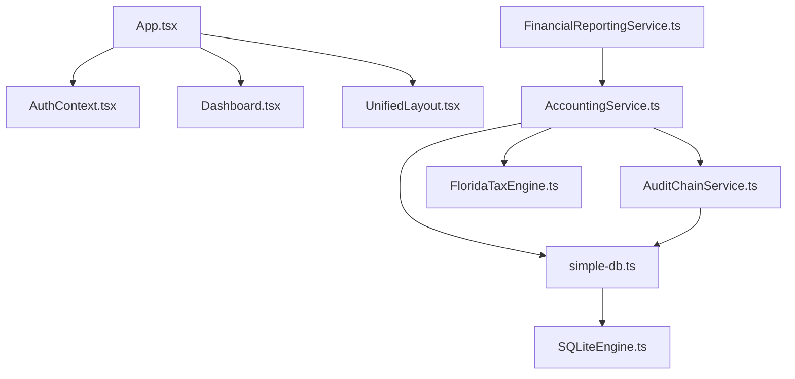

# Account Express Codebase Map

> AI-generated dependency graph and file registry for Antigravity Kit.

---

## 🗺️ High-Level Dependency Graph

---

## 📂 Core Registry

### 1. Data Layer (`src/database/`)

- **simple-db.ts**: Central schema, migrations, and shared data logic.
- **SQLiteEngine.ts**: abstraction over wa-sqlite.
- **ForensicDiagnostic.ts**: Integrity checks and data repair.

### 2. Business Services (`src/services/`)

- **accounting/**: Ledger logic, Trial Balance, Journal Entries.
- **audit/**: Block-hash chained audit log.
- **ai/**: AIAssistant with forensic read-only access.
- **backup/**: Encrypted .aex backup management.

### 3. UI Layer (`src/components/`, `src/pages/`)

- **accounting/**: Manual Journal Entries, Reports UI.
- **inventory/**: Product valuation and stock reports.
- **dashboard/**: KPI cards and trend analysis.

---

## 🧪 Testing Matrix

| Suite | Target | Type |
| ----- | ------ | ---- |
| `Accounting.test.ts` | Ledger and Double-Entry | Unit/Logic |
| `AuditChain.test.ts` | Integrity and Hash Chains | Unit/Sec |
| `FloridaTax.test.ts`| Florida DOR Compliance | Unit/Reg |

---

## ⚠️ Cross-Reference Warnings

- **Breaking Change**: Any schema modification in `journal_entries` MUST be updated in `AuditChainService` (Logic Clock) and `FinancialReportingService` (Balance calculations).
- **Service Worker**: `sw.js` caches static assets; updates to iconography or critical vendors require incrementing the cache version.
